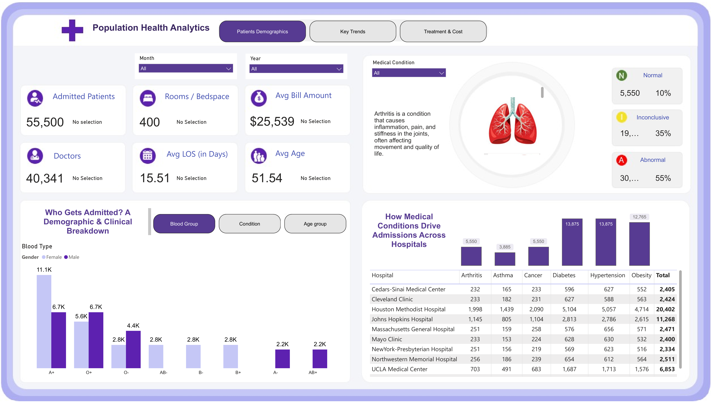
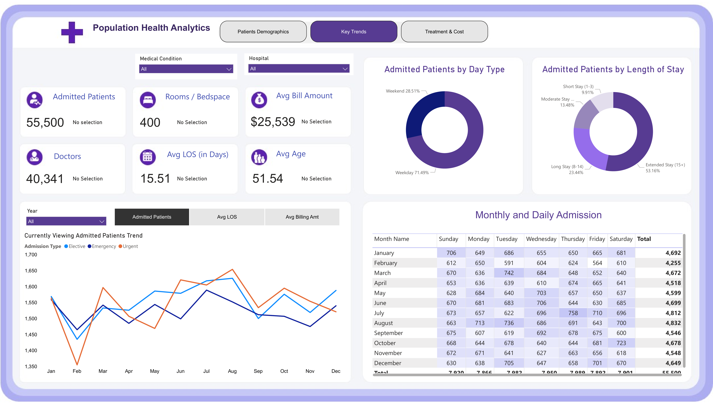
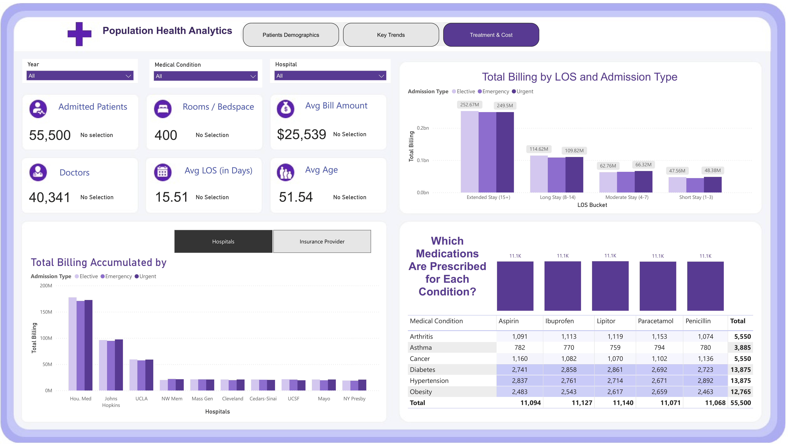

# Population Health Analytics

## Project Overview
This project involves building a real-time population health analytics system designed to transform patient records across multiple hospitals into actionable insights. By uncovering hidden patterns in patient admissions, identifying billing inefficiencies, and enabling data-driven clinical decisions, this solution provides unified visibility into population health trends that drive outcomes and costs.

The analysis covers **55,500 patient admissions** across **9 major hospitals**, focusing on 6 medical conditions.

## Dashboards

### 1. Who Gets Admitted? (Demographics)

This dashboard provides a comprehensive breakdown of patient demographics across all 9 hospitals. It includes insights into:
- Gender distribution
- Age groups
- Blood type distribution
- Admission types and medical conditions

### 2. Monthly and Daily Admission (Trends)

A time-series analysis of patient flow and admission patterns. Key findings include:
- 71.49% of admissions occurring on weekdays, highlighting the need for optimized staffing models.
- Seasonal and monthly admission trends to assist in capacity planning.

### 3. Treatment & Cost (Financials)

Focuses on billing analysis and treatment patterns. Insights include:
- Billing analysis by length of stay (LOS) and hospital.
- Medication patterns for different medical conditions.
- Identification of cost outliers and opportunities for discharge planning optimization.

## Key Metrics
- **Total Patient Admissions:** 55,500
- **Average Length of Stay:** 15.51 days
- **Average Patient Billing:** $25,539
- **Hospitals Analyzed:** 9
- **Weekday Admissions:** 71.49%
- **Abnormal Test Results:** 55%

## Technical Stack
- **SQL:** Healthcare data extraction and complex query development.
- **Power BI:** Data modeling (Star Schema), DAX measures, and interactive dashboard development.
- **Excel:** Power Query for data transformation and export.
- **Security:** HIPAA-compliant data handling and Row-Level Security (RLS).

## Author
**Siddhant Singh**
Data Analyst | Business Analyst
Specializing in Workforce Intelligence & People Analytics and Healthcare

- **Email:** siddhantsid2199@gmail.com
- **LinkedIn:** [linkedin.com/in/siddhantsingh21](https://www.linkedin.com/in/siddhantsingh21)
